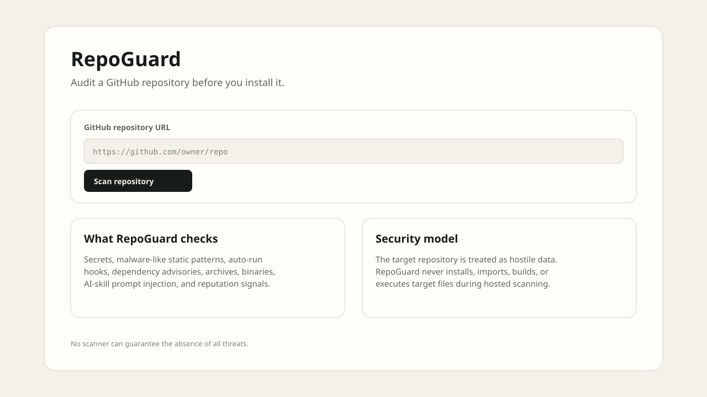
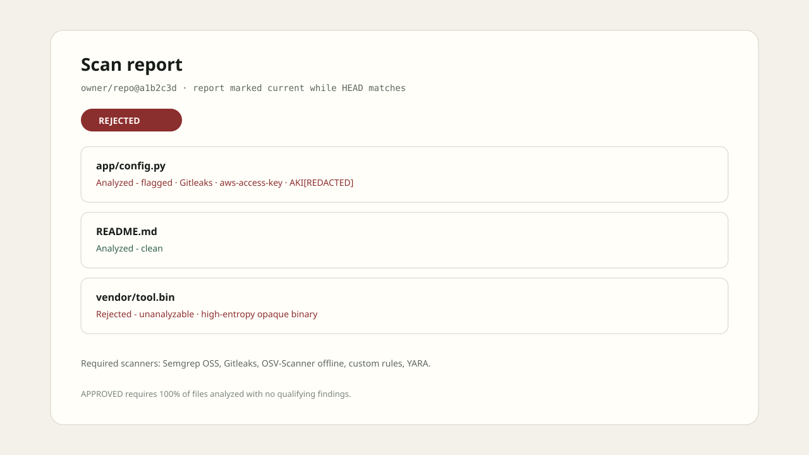
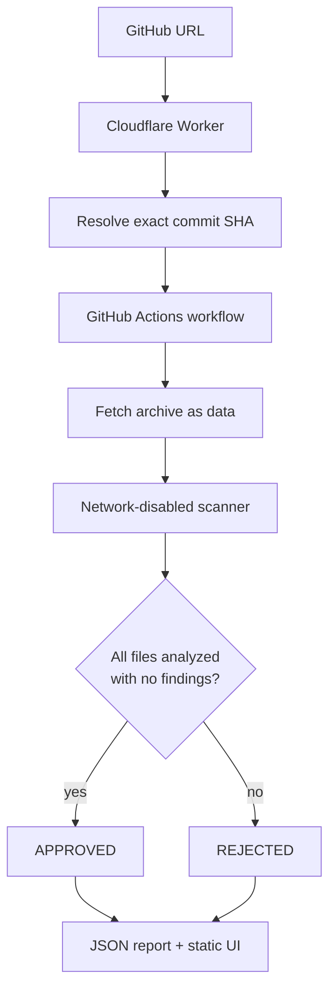

# RepoGuard

Pre-install scanner for a public GitHub repository or AI-skill package.

Submit a GitHub URL. RepoGuard resolves it to an exact commit SHA, fetches the archive as data, analyzes it **without installing, importing, building, or executing** target code, and returns one verdict: **APPROVED** or **REJECTED**.

No scanner can guarantee the absence of all threats. **APPROVED** means every file was analyzed and the configured checks found no qualifying findings. It does not mean the software is safe.

## Screenshots

The hosted UI is a static page: paste a GitHub URL, start a scan, then open a report tied to the scanned commit.





These diagrams match the current `web/` UI. Replace them with PNG captures from a live scan when you have a hosted deployment.

## What it checks

- Secrets and credential-like strings (Gitleaks, with values redacted in reports)
- Malware-like static patterns and custom security rules (Semgrep, YARA, built-in rules)
- AI-skill markdown and invisible-instruction patterns
- Known dependency vulnerabilities (OSV-Scanner, offline database)
- Dependency typosquatting heuristics
- Archives (path traversal, symlinks, encrypted members, compression bombs, nested depth)
- Opaque binaries, high-entropy blobs, and executables without matching source
- Public GitHub reputation signals (observational, not proof)

Every file gets one status:

- Analyzed - clean
- Analyzed - flagged
- Rejected - unanalyzable *(with a reason)*

Any flagged file, unanalyzable file, scanner error, timeout, or exceeded limit produces **REJECTED**. A scan never returns an unknown state.

## Security model

- Target repository content is treated as hostile input.
- Hosted scanning runs in a **network-disabled** scanner container and is not given API keys or platform secrets.
- URL intake accepts HTTPS GitHub repository URLs only, with an optional `/tree/ref`.
- Fetching rejects redirects, unsafe archive paths, symlinks, encrypted archive members, excessive compression ratios, excessive expanded size, excessive file count, and excessive single-file size.
- Findings include path, line, snippet, rule, explanation, and scanner source.
- Reports are tied to the exact commit SHA and are marked outdated when the current target HEAD differs.
- Secrets are redacted before they are stored in reports.

Hosted mode is static analysis only. It never runs target setup or install commands.

Local mode can optionally run declared install/setup commands inside an isolated, networkless behavior-test container. Sensitive-path reads, network connection attempts, denied writes, or a non-zero setup result cause rejection.

## Architecture

```text
Browser (GitHub Pages)
        |
        v
Cloudflare Worker  -- validates URL, rate limits, resolves SHA, dispatches scan
        |
        v
GitHub Actions     -- hosted scan orchestrator
        |
        v
Scanner container  -- no network, no secrets, target mounted read-only
        |
        v
JSON report        -- committed to this repo and/or cached in Cloudflare KV
```



Layout:

```text
app/       Python intake, fetching, extraction, normalization, scanners, verdict
rules/     Semgrep, YARA, and Gitleaks rules
worker/    Cloudflare Worker API
web/       GitHub Pages static UI
.github/   hosted scan and Pages workflows
tests/     harmless fixtures and automated tests
scripts/   local scan, optional behavior test, optional VirusTotal hash lookup
docs/      architecture, decisions, deployment, limits, testing
reports/   persisted JSON scan reports
```

## Requirements

- Docker and Docker Compose
- Python 3.11+
- Git

The Python core is standard-library only. `requirements.txt` pins pytest for tests.

## Setup

```bash
git clone https://github.com/solsonaM/RepoGuard.git
cd RepoGuard
python3 -m venv .venv
source .venv/bin/activate   # Windows: .venv\Scripts\activate
pip install -r requirements.txt
pytest -q
```

### Docker (local API + scanner)

```bash
docker compose up --build
```

The static UI in `web/` talks to `http://127.0.0.1:8787` by default (`web/config.js`). Open `web/index.html` through a local static server after the compose stack is up.

### One-shot local scan

```bash
scripts/local_scan.sh https://github.com/owner/repo
```

### Optional local-only behavior test

```bash
scripts/local_behavior_test.sh /path/to/repository
```

This path is local-only. It is not used for hosted scans.

### Optional VirusTotal hash lookup

`scripts/vt_hash_lookup.py` is a local helper. Do not put a VirusTotal key in frontend JavaScript, Worker source, or the scanned repository.

## Tests

```bash
pytest -q
```

Fixtures are harmless strings and generated binary, encrypted, and archive samples. **No real malware is included.**

See `docs/README-TESTING.md`.

## Hosted deployment (free tier)

Exact steps: [`docs/DEPLOY.md`](docs/DEPLOY.md).

Short version:

1. Create a free Cloudflare account and a KV namespace named `REPOGUARD_KV`.
2. Create a **fine-grained** GitHub token scoped only to `solsonaM/RepoGuard`.
3. Store it as the Worker secret `GITHUB_TOKEN`. Never put it in `web/`.
4. Deploy the Worker. Point `web/config.js` at the Worker URL.
5. Enable GitHub Pages from the included workflow (Settings → Pages → GitHub Actions).

The prototype caps scans per day and per IP. It uses GitHub Actions, GitHub Pages, Cloudflare Workers/KV, open-source scanners, and standard-library Python. There are no paid APIs and no required credit cards. Limits and design choices: [`docs/DECISIONS.md`](docs/DECISIONS.md).

## Limitations

See [`docs/LIMITATIONS.md`](docs/LIMITATIONS.md).

- Novel malware, logic bombs, and environment-specific abuse can evade pattern-based detection.
- Repository reputation signals are incomplete snapshots.
- OSV results depend on the offline database.
- Gitleaks and YARA only detect what their rules describe.
- Opaque binaries without an acceptable analysis path are rejected.
- Hosted scanning does not execute target setup or install behavior.

## Docs

- [Architecture](docs/ARCHITECTURE.md)
- [Decisions](docs/DECISIONS.md)
- [Deploy](docs/DEPLOY.md)
- [Limitations](docs/LIMITATIONS.md)
- [Testing](docs/README-TESTING.md)
